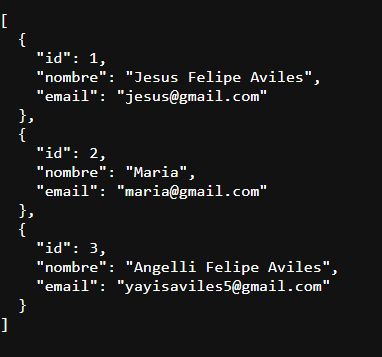
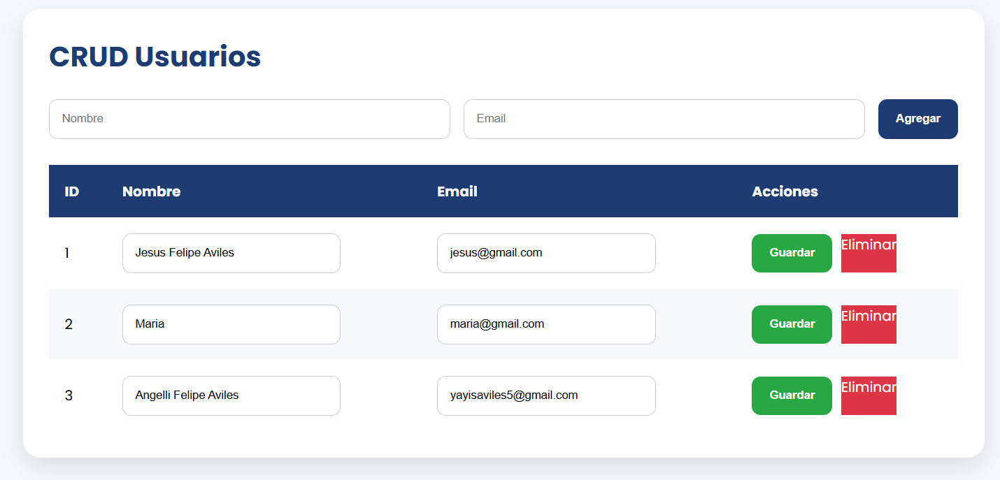

# API Node MVC 🚀

> API REST CRUD desarrollada con Node.js, Express y MySQL bajo arquitectura MVC. Incluye vistas renderizadas con EJS y configuración lista para producción.

---

## Características

- ✅ CRUD completo (Crear, Leer, Actualizar, Eliminar)
- ✅ Arquitectura MVC limpia y escalable
- ✅ API REST con endpoints bien definidos
- ✅ Conexión a MySQL con variables de entorno
- ✅ Vistas con EJS/HTML
- ✅ Servidor con Express + Nodemon en desarrollo

---

## Tecnologías

| Tecnología | Versión | Uso                   |
| ---------- | ------- | --------------------- |
| Node.js    | ≥ 18    | Runtime del servidor  |
| Express    | 4.x     | Framework HTTP        |
| MySQL      | 8.x     | Base de datos         |
| EJS        | 3.x     | Motor de plantillas   |
| dotenv     | 16.x    | Variables de entorno  |
| Nodemon    | 3.x     | Recarga en desarrollo |

---

## Estructura del proyecto

```
src/
├── config/          # Configuración de la base de datos
├── controllers/     # Lógica de negocio
├── models/          # Interacción con la BD
├── routes/          # Definición de rutas
├── views/           # Plantillas EJS
├── app.js           # Configuración de Express
└── server.js        # Punto de entrada
```

---

## Instalación

### 1. Clonar el repositorio

```bash
git clone https://github.com/JesusFelipeA/api_node_jfa.git
cd api_node
```

### 2. Instalar dependencias

```bash
npm install
```

### 3. Configurar variables de entorno

Crea un archivo `.env` en la raíz del proyecto:

```env
DB_HOST=localhost
DB_USER=tu_usuario
DB_PASSWORD=tu_contraseña
DB_NAME=api_node
DB_PORT=3306
```

> ⚠️ **Nunca subas el archivo `.env` a tu repositorio.** Asegúrate de que esté en `.gitignore`, configuralo en la carpeta raiz de tuy proyecto.

### 4. Configurar la base de datos

```sql
CREATE DATABASE api_node;

USE api_node;

CREATE TABLE users (
    id    INT AUTO_INCREMENT PRIMARY KEY,
    nombre VARCHAR(100) NOT NULL,
    email  VARCHAR(100) NOT NULL UNIQUE
);
```

---

## Ejecución

```bash
# Modo desarrollo (con recarga automática)
npm start

# O directamente con node
node src/server.js
```

El servidor quedará disponible en: `http://localhost:3000`

---

## Endpoints

| Método | Ruta                    | Descripción               |
| ------ | ----------------------- | ------------------------- |
| GET    | `/api/users/api`        | Listar todos los usuarios |
| POST   | `/api/users/add`        | Crear un usuario          |
| POST   | `/api/users/update/:id` | Actualizar un usuario     |
| GET    | `/api/users/delete/:id` | Eliminar un usuario       |

> 💡 **Nota:** En una API REST convencional, `update` usa `PUT/PATCH` y `delete` usa el método `DELETE`. Considera refactorizar los métodos si planeas seguir el estándar REST estrictamente.

---

## Vistas

<!-- Agrega capturas de pantalla aquí -->

> 📸 _Capturas de pantalla próximamente._
> 
> 

---

## Roadmap

- [ ] Autenticación con JWT
- [ ] Sistema de roles (admin / usuario)
- [ ] Validaciones de entrada (express-validator)
- [ ] Paginación en listados
- [ ] Buscador de usuarios
- [ ] Dashboard de administración
- [ ] Dockerización del proyecto
- [ ] Tests unitarios e integración

---

## Aprendizajes

Desarrollar este proyecto permitió profundizar en:

- Separación de responsabilidades con arquitectura MVC
- Conexión y consultas a MySQL desde Node.js
- Manejo de rutas y middlewares en Express
- Renderizado de vistas dinámicas con EJS
- Gestión de configuración con variables de entorno

---

## Autor

**Jesus Felipe Aviles**

[](https://github.com/JesusFelipeA)

---

## Licencia

Este proyecto está bajo la licencia [MIT](LICENSE).

---

<p align="center">Hecho con ☕ y Node.js</p>
